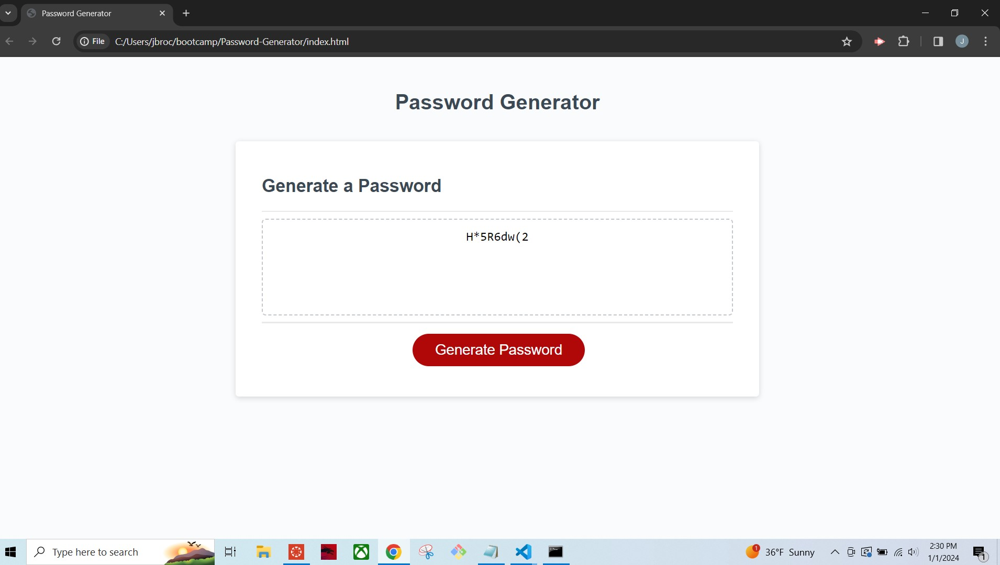

# Password-Generator

## Description

I completed the JavaScript coding for a password generator in order to better understand the use of and connection between variables, arrays, and conditions to create a functional application that is user-friendly and accessible. I was able to do this by defining the variables and using loops and if statements. It provides clients with a simple application to reach their desired result: A random password!

## Installation

N/A

## Usage

This page will assist in generating a random password using client input for password length, letter casing, numerals, and special characters.

Here is a screenshot of my application:

Here is a link to my deployed application:

## Credits
 Information and tutorials from:
-https://developer.mozilla.org/en-US/docs/Web/JavaScript/Reference/Global_Objects/isNaN

-httP://www.w3schools.com

-Net Ninja online JavaScript Tutorial for beginnger: https://www.youtube.com/playlist?list=PL4cUxeGkcC9i9Ae2D9Ee1RvylH38dKuET

Checked code against pubished gitHub pages:
-https://github.com/fmiusov/passwordGenerator/tree/master
-https://github.com/ariehh1/JavaScript-Password-Generator/tree/master

## License

MIT License

Copyright (c) [2023] [Jennie Brockhoff]

Permission is hereby granted, free of charge, to any person obtaining a copy
of this software and associated documentation files (the "Software"), to deal
in the Software without restriction, including without limitation the rights
to use, copy, modify, merge, publish, distribute, sublicense, and/or sell
copies of the Software, and to permit persons to whom the Software is
furnished to do so, subject to the following conditions:

The above copyright notice and this permission notice shall be included in all
copies or substantial portions of the Software.

THE SOFTWARE IS PROVIDED "AS IS", WITHOUT WARRANTY OF ANY KIND, EXPRESS OR
IMPLIED, INCLUDING BUT NOT LIMITED TO THE WARRANTIES OF MERCHANTABILITY,
FITNESS FOR A PARTICULAR PURPOSE AND NONINFRINGEMENT. IN NO EVENT SHALL THE
AUTHORS OR COPYRIGHT HOLDERS BE LIABLE FOR ANY CLAIM, DAMAGES OR OTHER
LIABILITY, WHETHER IN AN ACTION OF CONTRACT, TORT OR OTHERWISE, ARISING FROM,
OUT OF OR IN CONNECTION WITH THE SOFTWARE OR THE USE OR OTHER DEALINGS IN THE
SOFTWARE.